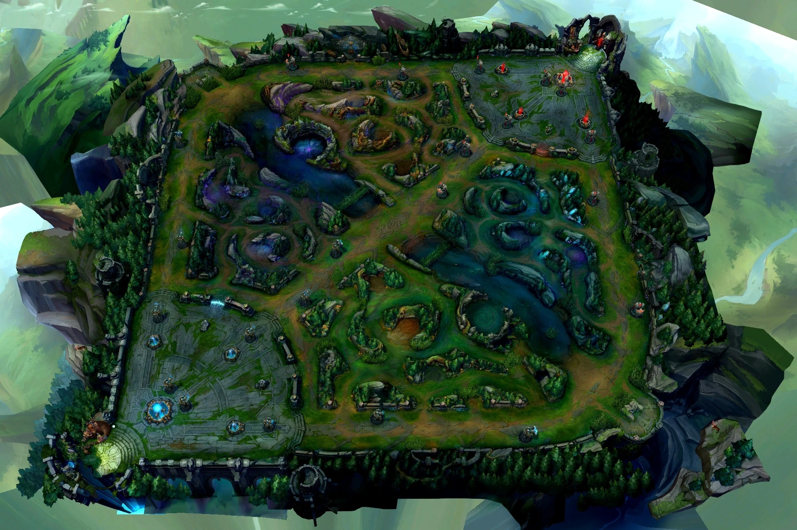

# What is Jungling?

The Jungler or Jungling role is one of five main roles in League of Legends. This role is played not in a dedicated lane but between them. The map Summoners Rift, has three lanes and the areas between them is known as the Jungle. This is where the Jungler resides and battles between numerous neutral monsters for gold and experience. The Jungler moves around the map providing assistance to teammates in their perspective lanes when they have the opportunity.

## Main Responsibilities of a Jungler

A jungler has many key task during a game such as:

- Defeat [[02-Jungle-Camps|Jungle Camps]] for gold and experience.
- The use [[03-Smite-and-Jungle-Items|Smite and Jungle Items]] effectively and adaptively.
- Help teammates by relying on the [[04-Ganking-Basics|Ganking Basics]].
- Secure important [[05-Objectives|Objectives]]
- Being sure to observe and track the enemy jungler by observing the minimap.

### Map Pressure

Junglers are special unlike other players playing lanes. As a Jungler you can travel between different areas of the map and during these movements you can help influence these areas. While moving you are clearing camps as well as positioning yourself based on what is happening at different times of the game.

> A succesful Jungler must balance farming, map pressure, teammate support, and objective control.

This makes the jungle role vital in all progressions of the game.